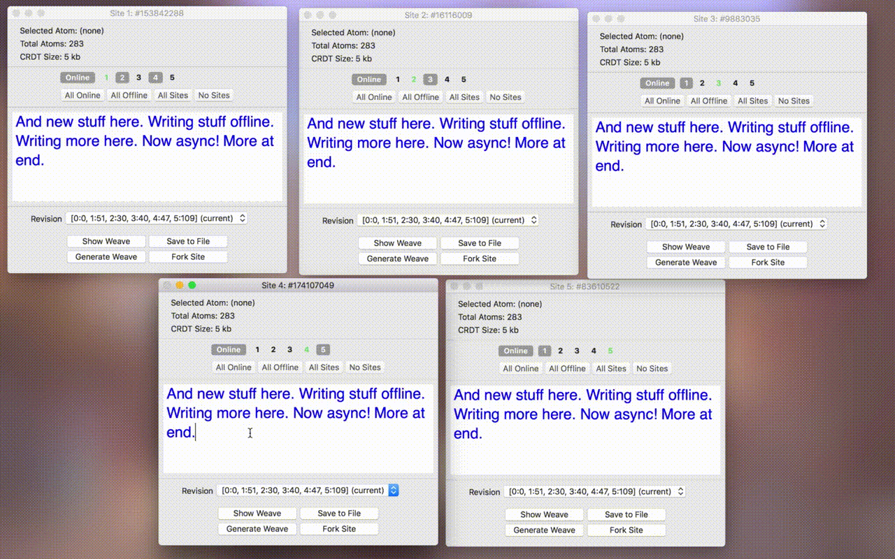
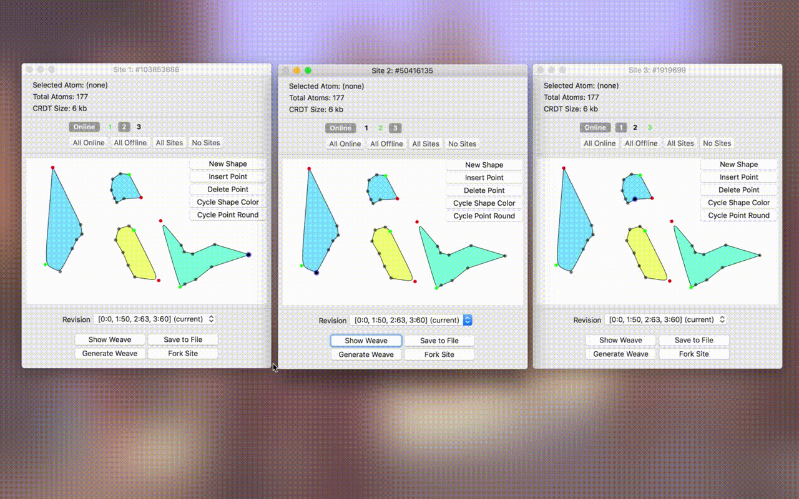

*This repository is a companion to the article "[Data Laced with History: Causal Trees & Operational CRDTs][article]", where I examine the fascinating new class of "operational" CRDTs in detail. Not a framework; for educational use only. Please don't use this in production unless you know what you're doing!*

A generic implementation of Victor Grishchenko's [Causal Tree][trees] CRDT, written in Swift. State-based (CvRDT) implementation. Features many tweaks, including a site identifier map, atom references, and priority atoms. Uses Lamport timestamps instead of "awareness".

Two pieces of companion software are included. The first is a macOS app that simulates device sync over a hypothetical network with any arbitrary topology and any number of partitions. The app is designed for testing the resiliency of a CRDT under difficult network conditions and features editing support for text and vector graphics. The second is a very basic, CT-based text editor for iOS that works equally well online and offline, syncs documents over CloudKit, and supports real-time collaboration over CloudKit Sharing. No extra servers required! (Such is the glory of CRDTs.)

Performance is good: everything should be *O*(*n*log*n*) or faster.

[article]: http://archagon.net/blog/2018/03/24/data-laced-with-history/
[trees]: http://www.ds.ewi.tudelft.nl/~victor/articles/ctre.pdf
